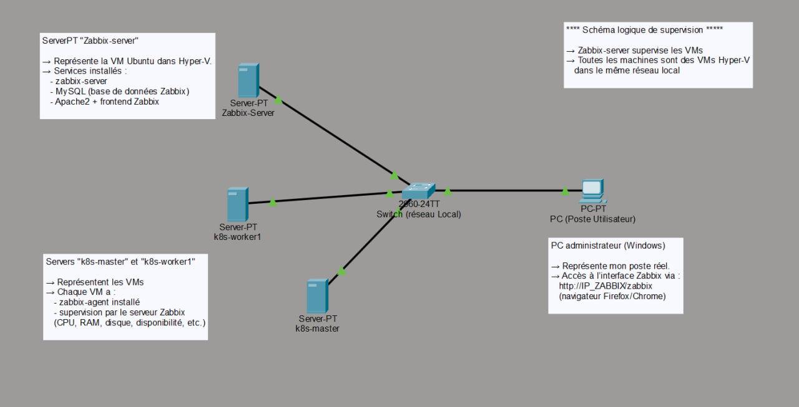

# Projet Zabbix – Supervision d'un cluster K8s sur VM Hyper-V

Ce dépôt décrit l'installation et la configuration d'un **serveur Zabbix 6.4** sur une VM Ubuntu 22.04 hébergée dans **Hyper-V**, ainsi que la mise en place d'un **scénario de supervision CPU** pour les nœuds d'un petit cluster Kubernetes (master + workers).

> ⚠️  Tous les éléments entre `<...>` sont des **placeholders** à adapter sur l'environnement local uniquement.

---

## 1. Objectifs du projet

- Déployer un **serveur de supervision Zabbix** dans une VM Hyper-V.

- Utiliser **MySQL** comme base de données de Zabbix.

- Superviser plusieurs nœuds Linux (ex. `k8s-master`, `k8s-worker1`) via **zabbix-agent**.

- Mettre en place un **déclencheur d'alerte** :

  - *"Utilisation CPU élevée (>80 % pendant 5 minutes)"*.

- Tester et documenter ce scénario pour un **rapport de mini-projet / portfolio GitHub**, tout en respectant les bonnes pratiques de cybersécurité.

---

## 2. Architecture générale

- Hyperviseur : **Hyper-V** (Windows)

- VM principale :

  - OS : Ubuntu Server 22.04 LTS

  - Rôle : serveur Zabbix + frontend Web + base MySQL

- Autres VMs : nœuds Linux surveillés (ex. nœuds Kubernetes)

- Accès à Zabbix : interface Web via HTTP sur le **réseau local** uniquement.

### 2.1. Schéma logique simplifié

```text
[PC / Laptop] -- HTTP (port 80) --> [VM Ubuntu "Zabbix"] -- MySQL local
                     |
                     +-- Zabbix-server (port 10051)
                     |
                     +-- Vers agents Zabbix sur : k8s-master / k8s-worker1 / k8s-worker2 (port 10050)
```

### 2.2. Schéma logique détaillé des interconnexions

Le schéma suivant illustre l'architecture complète des interconnexions Zabbix avec les différents composants du réseau :



> 📁 **Fichier source** : Le schéma logique détaillé est disponible au format Packet Tracer dans le dossier `Zabbix schéma Cisco/Zabbix début schéma.pkt`. Ce fichier peut être ouvert avec Cisco Packet Tracer pour visualiser et modifier l'architecture réseau.

---

## 3. Préparation de la VM Hyper-V (Ubuntu 22.04)

1. Création d'une VM dans Hyper-V :

   * OS : Ubuntu Server 22.04 (ISO officiel).

   * CPU : ≥ 2 vCPU.

   * RAM : ≥ 2 Go (4 Go recommandé pour le confort).

   * Disque : ≥ 20 Go.

   * Carte réseau : connectée à un **vSwitch externe** (accès au LAN).

2. Installation d'Ubuntu :

   * Nom d'hôte générique, ex. `k8s-master` ou `zabbix-server`.

   * Création d'un utilisateur non-root (ex. `master`).

   * Mise à jour système :

   ```bash
   sudo apt update && sudo apt upgrade -y
   ```

---

## 4. Installation des composants Zabbix

### 4.1. MySQL Server

```bash
sudo apt install mysql-server -y
```

Optionnel mais recommandé : sécurisation de MySQL :

```bash
sudo mysql_secure_installation
```

> Utiliser un **mot de passe fort** pour le compte root MySQL et ne jamais le stocker dans le dépôt.

### 4.2. Dépôt Zabbix 6.4 + paquets

```bash
wget https://repo.zabbix.com/zabbix/6.4/ubuntu/pool/main/z/zabbix-release/zabbix-release_6.4-1+ubuntu22.04_all.deb
sudo dpkg -i zabbix-release_6.4-1+ubuntu22.04_all.deb
sudo apt update
```

Installation des composants Zabbix :

```bash
sudo apt install \
  zabbix-server-mysql \
  zabbix-frontend-php \
  zabbix-apache-conf \
  zabbix-sql-scripts \
  zabbix-agent -y
```

---

## 5. Base de données Zabbix (MySQL)

Connexion MySQL en root :

```bash
sudo mysql
```

Création de la base et de l'utilisateur Zabbix :

```sql
CREATE DATABASE zabbix
  CHARACTER SET utf8mb4
  COLLATE utf8mb4_bin;

CREATE USER 'zabbix'@'localhost' IDENTIFIED BY '<MOT_DE_PASSE_FORT>';

GRANT ALL PRIVILEGES ON zabbix.* TO 'zabbix'@'localhost';

EXIT;
```

> `<MOT_DE_PASSE_FORT>` : chaîne longue, aléatoire et unique.

> Ne jamais mettre la vraie valeur dans un dépôt Git public.

Import du schéma Zabbix :

```bash
sudo mysql -e "SET GLOBAL log_bin_trust_function_creators = 1;"

zcat /usr/share/zabbix-sql-scripts/mysql/server.sql.gz | \
  mysql -uzabbix -p zabbix
```

---

## 6. Configuration du serveur Zabbix

Éditer le fichier `/etc/zabbix/zabbix_server.conf` :

```bash
sudo nano /etc/zabbix/zabbix_server.conf
```

Paramètres principaux :

```ini
DBHost=localhost
DBName=zabbix
DBUser=zabbix
DBPassword=<MOT_DE_PASSE_FORT>
```

> Le fichier réel **ne doit pas** être committé dans un dépôt public.

> Utiliser soit un exemple anonymisé, soit `.gitignore`.

Redémarrer le service :

```bash
sudo systemctl restart zabbix-server
sudo systemctl enable zabbix-server
sudo systemctl status zabbix-server
```

Vérifier l'écoute sur le port 10051 :

```bash
sudo ss -ltnp | grep 10051
# OU
nc -vz localhost 10051
```

---

## 7. Configuration du frontend Zabbix (Apache / PHP)

### 7.1. Timezone PHP

Éditer `/etc/zabbix/apache.conf` :

```bash
sudo nano /etc/zabbix/apache.conf
```

Adapter la timezone :

```apache
php_value date.timezone Europe/Paris
```

### 7.2. Fichier de configuration Web

Après l'assistant Web, Zabbix génère le fichier :

`/etc/zabbix/web/zabbix.conf.php`

Exemple anonymisé :

```php
<?php
$DB['TYPE']     = 'MYSQL';
$DB['SERVER']   = 'localhost';
$DB['PORT']     = '0';
$DB['DATABASE'] = 'zabbix';
$DB['USER']     = 'zabbix';
$DB['PASSWORD'] = '<MOT_DE_PASSE_FORT>';

$ZBX_SERVER      = 'localhost';
$ZBX_SERVER_PORT = '10051';
$ZBX_SERVER_NAME = 'Zabbix server';
```

> Là encore, le fichier réel ne doit pas être exposé publiquement.

Redémarrage Apache :

```bash
sudo systemctl restart apache2
sudo systemctl enable apache2
```

---

## 8. Accès à l'interface Web Zabbix

1. Récupérer l'adresse IP de la VM Zabbix :

   ```bash
   ip -4 addr show
   ```

   Exemple : `<IP_ZABBIX>`

2. Depuis un navigateur sur le réseau local :

   ```text
   http://<IP_ZABBIX>/zabbix
   ```

3. Suivre l'assistant d'installation (vérification des prérequis, DB, paramètres serveur).

4. Connexion initiale :

   * Utilisateur : `Admin`

   * Mot de passe : `zabbix`

   * ➜ **Changer immédiatement le mot de passe** dans l'interface.

### 8.1. Tableau de bord Zabbix

Une fois connecté, le tableau de bord Zabbix s'affiche avec les informations du serveur :


---

## 9. Installation et configuration des agents Zabbix sur les nœuds

Sur chaque nœud Linux à superviser (ex. `k8s-worker1`) :

### 9.1. Installation de l'agent

```bash
sudo apt update
sudo apt install zabbix-agent -y
```

### 9.2. Configuration de l'agent

Éditer `/etc/zabbix/zabbix_agentd.conf` :

```bash
sudo nano /etc/zabbix/zabbix_agentd.conf
```

Adapter ces lignes :

```ini
Server=<IP_ZABBIX>
ServerActive=<IP_ZABBIX>
Hostname=<NOM_DU_NOEUD>
```

* `<IP_ZABBIX>` : IP de la VM où tourne zabbix-server.

* `<NOM_DU_NOEUD>` : nom logique (ex. `k8s-worker1`), qui doit correspondre au *Host name* dans Zabbix.

Redémarrer l'agent :

```bash
sudo systemctl restart zabbix-agent
sudo systemctl enable zabbix-agent
sudo systemctl status zabbix-agent
```

### 9.3. Ajouter l'hôte dans l'interface Zabbix

Dans l'interface Web :

1. **Configuration → Hôtes → Créer un hôte**

2. Renseigner :

   * **Nom de l'hôte** : `<NOM_DU_NOEUD>`

   * **Nom visible** : identique ou plus descriptif.

   * **Groupes** : ex. `Linux servers` ou `Kubernetes nodes`.

3. Interface d'agent :

   * Type : `Agent`

   * IP : `<IP_DU_NOEUD>`

   * Port : `10050`

4. Onglet **Modèles** :

   * Ajouter le modèle : **`Linux par agent Zabbix`** (ou équivalent).

5. Enregistrer.

L'hôte apparaît alors dans **Supervision → Hôtes** avec un statut (Disponible / Inconnu / Non disponible).

### 9.4. Hôtes créés et connectés

Voici un exemple des hôtes configurés et connectés dans Zabbix :


.jpg)

---

## 10. Scénario d'alerte : "Utilisation CPU > 80 % pendant 5 minutes"

Ce scénario illustre la création d'un déclencheur dans le modèle Linux pour tous les nœuds supervisés.

### 10.1. Fonctionnement des alertes Zabbix

Le schéma suivant illustre le fonctionnement général du système d'alertes Zabbix, depuis la collecte des métriques jusqu'à la notification :


Ce schéma montre le flux complet :
- **Collecte** : Les agents Zabbix collectent les métriques sur les hôtes supervisés
- **Évaluation** : Le serveur Zabbix évalue les déclencheurs (triggers) en fonction des valeurs collectées
- **Détection** : Lorsqu'une condition est remplie, un problème est détecté
- **Notification** : Les actions configurées sont déclenchées (e-mail, Slack, etc.)
- **Résolution** : Quand la condition revient à la normale, le problème est automatiquement résolu

### 10.2. Création du déclencheur dans le modèle

1. Aller dans : **Configuration → Modèles**.

2. Ouvrir le modèle : **`Linux par agent Zabbix`**.

3. Onglet : **Déclencheurs**.

4. Bouton : **Créer un déclencheur**.

Paramètres :

* **Nom** :

  `Utilisation CPU élevée (>80 % pendant 5 minutes)`

* **Gravité** :

  `Haut` (ou `Moyen` selon le besoin).

* **Expression** : utiliser le **Constructeur d'expression** :

  * Élément : l'élément "Utilisation CPU" du modèle.

  * Fonction : `min(T)` avec `T = 5m`.

  * Condition : `> 80`.

Exemple d'expression générée (peut varier légèrement) :

```text
{Linux par agent Zabbix:system.cpu.util[,system,avg1].min(5m)}>80
```

Valider et **Ajouter** le déclencheur.

### 10.3. Création du déclencheur d'alerte

Voici la création du déclencheur dans l'interface Zabbix :


### 10.4. Commandes pour le déclencheur CPU

Voici les commandes utilisées pour configurer le déclencheur :


### 10.5. Test de l'alerte (mise en charge CPU)

Sur un hôte supervisé (ex. `k8s-worker1`) :

```bash
sudo apt install stress -y
stress --cpu 2 --timeout 600
```

* Simule une forte charge CPU pendant 10 minutes.

Dans Zabbix :

* Aller dans **Supervision → Problèmes** :

  * On observe un nouveau problème du type

    `Utilisation CPU élevée (>80 % pendant 5 minutes)` sur l'hôte concerné.

* Sur le **Tableau de bord**, le widget "Problèmes actuels" reflète également cette alerte.

Voici les problèmes artificiels affichés :


### 10.6. Résolution de l'alerte

Quand la charge redescend, le problème est automatiquement **résolu** :


Voici également les commandes de fin d'installation avec stress :


---

## 11. Cybersécurité & bonnes pratiques

Pour éviter d'exposer des informations exploitables par un attaquant :

* 🔐 **Mots de passe**

  * Utiliser des mots de passe forts pour :

    * MySQL (`root`, `zabbix`),

    * compte Zabbix `Admin`,

    * comptes système (SSH).

  * Ne jamais committer de mots de passe dans Git.

  * Utiliser des fichiers d'exemple anonymisés avec `<MOT_DE_PASSE_FORT>`.

* 🌐 **Exposition réseau**

  * Limiter l'accès HTTP à l'interface Zabbix au réseau interne.

  * Éviter l'exposition directe sur Internet. Si nécessaire : reverse proxy HTTPS, filtrage IP, VPN.

* 🧱 **Pare-feu (UFW)**

  * Exemple de configuration minimale sur la VM Zabbix :

    ```bash
    sudo ufw allow OpenSSH
    sudo ufw allow 80/tcp        # HTTP Zabbix (LAN uniquement)
    # sudo ufw allow 443/tcp     # HTTPS si reverse proxy
    sudo ufw enable
    ```

* 👤 **Comptes & privilèges**

  * Utiliser un compte non-root + sudo.

  * Désactiver le login SSH direct en root.

  * Mettre régulièrement à jour le système :

    ```bash
    sudo apt update && sudo apt upgrade -y
    ```

* 📁 **Git / GitHub**

  * Ajouter les fichiers de configuration sensibles à `.gitignore`, par ex. :

    ```gitignore
    /etc/zabbix/zabbix_server.conf
    /etc/zabbix/web/zabbix.conf.php
    ```

---

## 12. Vérifications finales

* Tableau de bord Zabbix :

  * "Le serveur Zabbix est en cours d'exécution" : **Oui**.

  * Hôte `Zabbix server` : **Disponible**.

  * Hôtes supervisés : **Disponibles**.

* Logs Zabbix :

  ```bash
  sudo tail -n 20 /var/log/zabbix/zabbix_server.log
  ```

  Aucun message d'erreur critique.

* Vérification des services :

  ```bash
  sudo systemctl status zabbix-server
  sudo systemctl status zabbix-agent
  sudo systemctl status apache2
  ```

---

## 13. Pistes d'amélioration

* Ajouter d'autres déclencheurs :

  * Espace disque > 80 %.

  * Hôte indisponible (ping / agent).

  * Utilisation mémoire élevée.

* Mettre en place des **actions de notification** (e-mail, Slack, etc.).

* Superviser des services applicatifs (pods Kubernetes, API, etc.).

* Ajouter un **reverse proxy HTTPS** (NGINX ou autre) devant Zabbix.

* Configurer des tableaux de bord personnalisés avec des graphiques avancés.

* Mettre en place des découvertes automatiques d'hôtes.

---

> Ce README sert de base documentaire pour le mini-projet Zabbix.

> Il décrit l'architecture, les étapes d'installation et un scénario d'alerte simple, sans divulguer d'informations permettant un accès direct à la machine.
